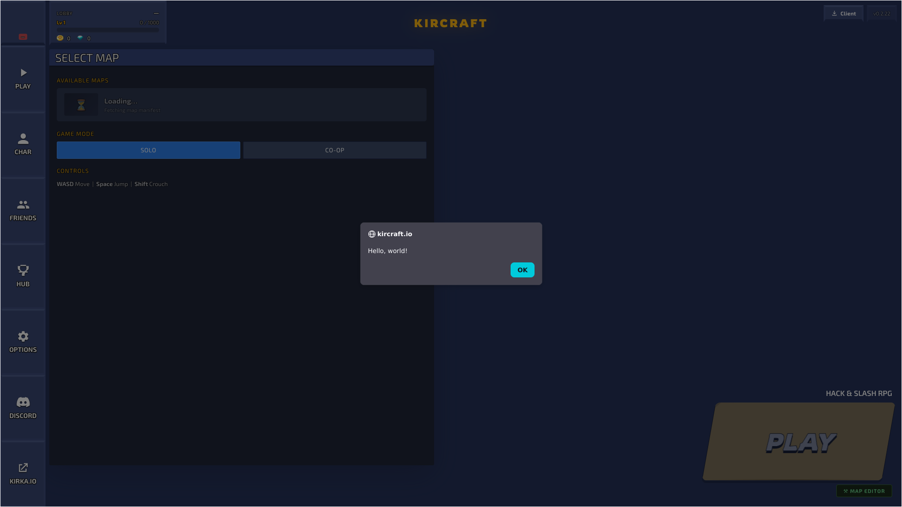
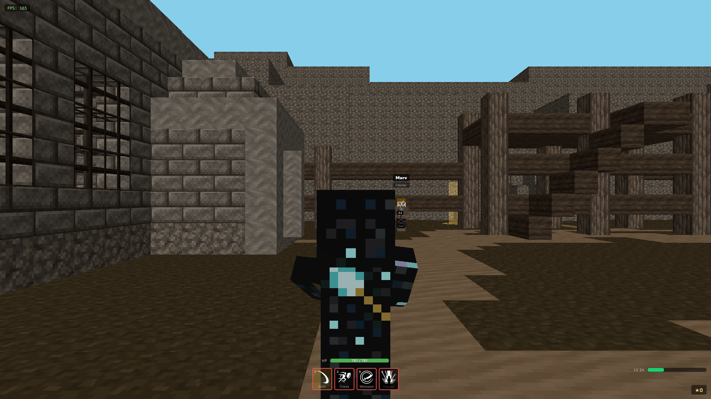
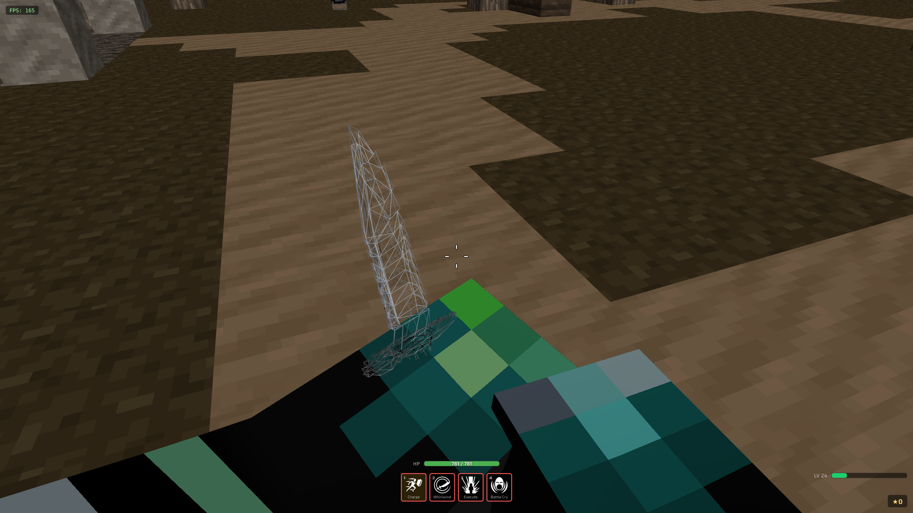
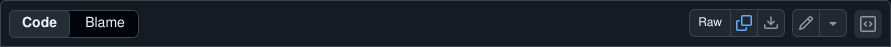
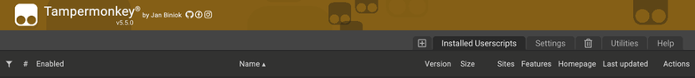
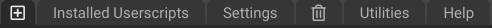
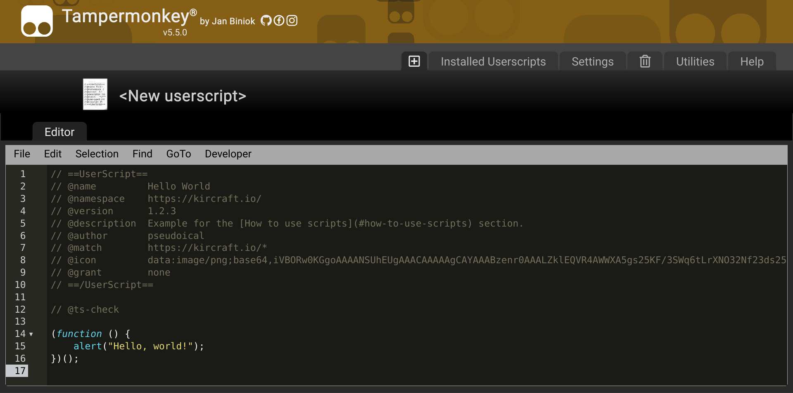
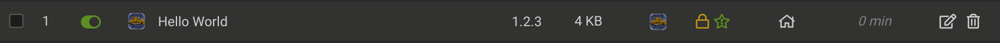

# KirCraft Scripts

See [How to use scripts](#how-to-use-scripts) for instructions.

# [Drop All](scripts/drop-all.js) v0.2.22

Automatically drop unwanted items for easier inventory management.

# [Hello World](scripts/hello-world.js) v1.2.3

Example for the [How to use scripts](#how-to-use-scripts) section.

# [Hide Crosshair](scripts/hide-crosshair.js) v0.2.22

Hide crosshair.

# [Hide Miss](scripts/hide-miss.js) v0.2.22

Hide "MISS" text when missing attacks.

# [Instant Lock](scripts/instant-lock.js) v0.2.22

Automatically confirm lock when locking an item.

# [Instant Resume](scripts/instant-resume.js) v0.2.22

Instantly load into the game.

# [Knife Wireframe](scripts/knife-wireframe.js) v0.2.22

Display knife model as a wireframe. Use at your own risk.

# [Show Inventory](scripts/show-inventory.js) v0.2.22

Automatically show inventory when going to a new location.

# [Show Scavenge](scripts/show-scavenge.js) v0.2.22

Automatically show scavenge wheel when walking over items.

# [Skill Bar Ready](scripts/skill-bar-ready.js) v0.2.22

Outline skill slot green when ready.

# [Wanted Items](scripts/wanted-items.js) v0.2.22

List wanted items and highlight them on scavenge wheel. Supports regex.

# How to use scripts

1. Install a userscript extension like **Tampermonkey**:  
    [ Tampermonkey for Chrome](https://chromewebstore.google.com/detail/tampermonkey/dhdgffkkebhmkfjojejmpbldmpobfkfo)  
    [ Tampermonkey for Firefox](https://addons.mozilla.org/en-US/firefox/addon/tampermonkey/)
     

2. **Choose** the **script** you want to use from above and click the blue text:
    # [Hello World](scripts/hello-world.js) v1.2.3

3. **Copy** the **script** by clicking the square icon (highlighted in blue) from the top menu:
    
     

4. Navigate to the Tampermonkey **dashboard**:
    
     

5. Click the **plus icon** on the top menu to create a new script:
    
     

6. Delete the default code and **paste** the **script** into the code editor:
    
     

7. Press **Ctrl+S** to save the script and ensure that it is enabled:
    
     

8. Go to **[kircraft.io](https://kircraft.io/)** and reload the page if necessary.

---

This project is licensed under the WTFPL, Version 2. See <a href="LICENSE">LICENSE</a> for details.

